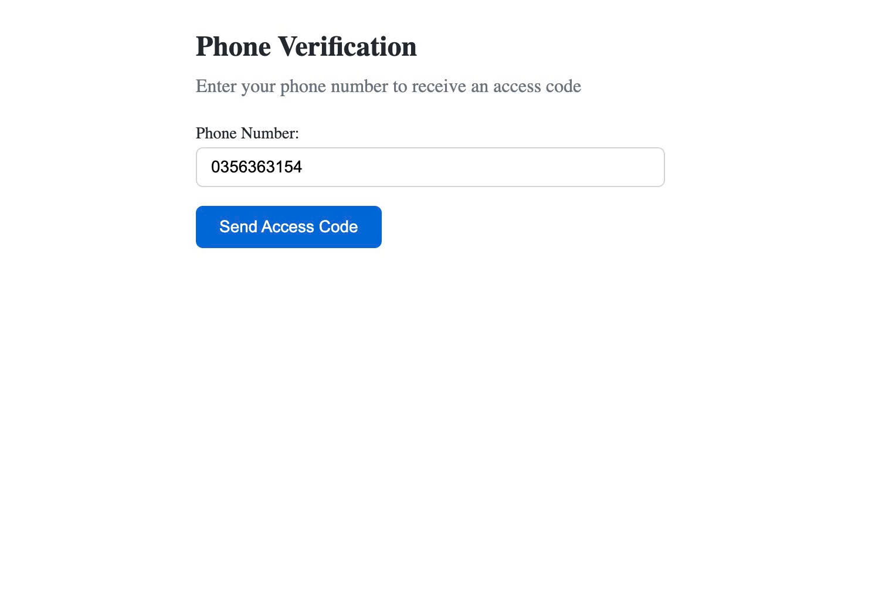
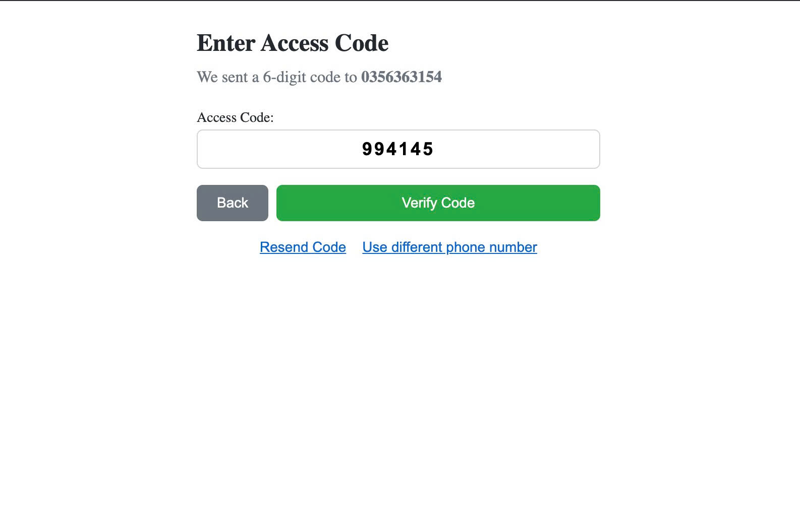

# Skipli Auth Backend

Backend API for application Skipli Auth with integration GitHub, Firebase và Twilio.

## Tech Stack

- **Node.js + Express** - Server framework
- **TypeScript** - Type safety
- **Firebase Admin** - User management
- **Twilio** - SMS/OTP services
- **GitHub API** - OAuth integration

## setup

1. Clone project:
   ```bash
   git clone <repo-url>
   cd skipli-auth-backend
   ```

2. Install dependencies:
   ```bash
   npm install
   ```

3. Create file `.env`:
   ```env
   PORT=3333
   
   # Twilio
   TWILIO_ACCOUNT_SID=your-account-sid
   TWILIO_AUTH_TOKEN=your-auth-token
   TWILIO_PHONE_NUMBER=your-phone-number

4. Add Firebase service account key in `firebase-service-account.json`

## Start application

```bash
npm dev
yarn dev
```

Server start at PORT `http://localhost:3333`

## Project Structure

```
src/
├── controllers/     # API handlers
├── services/        # Business logic
├── routes/          # Route definitions
├── models/          # Data models
├── middlewares/     # Express middlewares
├── utils/           # Helper functions
└── functions-cloud/ # Firebase & Twilio setup
```

## 📸 Screenshots

### Enter number phone


### Firebase OTP


### Verify OTP


### Search github

